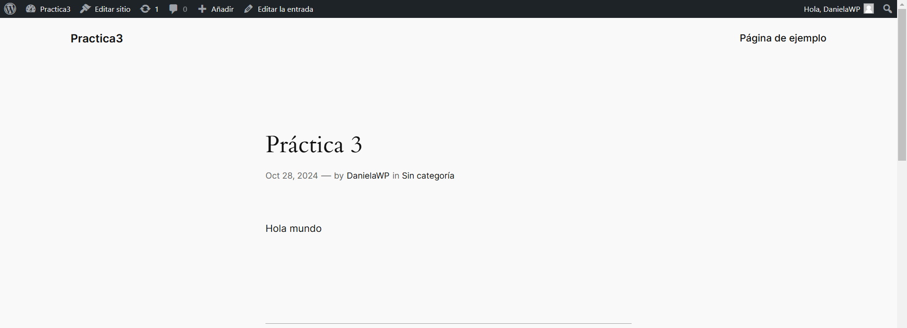

## Esquema para el ejercicio


### Crear red net-wp
```
docker network create net-wp
```
### Para que persista la información es necesario conocer en dónde mysql almacena la información.
# COMPLETAR LA SIGUIENTE ORACIÓN. REVISAR LA DOCUMENTACIÓN DE LA IMAGEN EN https://hub.docker.com/
En el esquema del ejercicio, la carpeta del contenedor (a) es /var/lib/mysql.

Ruta carpeta host: .../ejercicio3/db

### ¿Qué contiene la carpeta db del host?
La carpeta db en el host contiene los archivos de la base de datos de MySQL, incluyendo los datos, tablas, índices, y configuraciones necesarias para mantener la persistencia de la información.

### Crear un contenedor con la imagen mysql:8  en la red net-wp, configurar las variables de entorno: MYSQL_ROOT_PASSWORD, MYSQL_DATABASE, MYSQL_USER y MYSQL_PASSWORD
```
docker run -d --name mysql-container --network net-wp -e MYSQL_ROOT_PASSWORD=rootpassword -e MYSQL_DATABASE=wordpressdb -e MYSQL_USER=wordpressuser -e MYSQL_PASSWORD=wordpresspassword -v C:\Users\USER\Desktop\ConstruccionSW\Practica3\ejercicio3/db:/var/lib/mysql mysql:8
```

### ¿Qué observa en la carpeta db que se encontraba inicialmente vacía?
La carpeta db que estaba inicialmente vacía ahora contiene los archivos de la base de datos de MySQL necesarios para almacenar los datos de manera persistente.Estos archivos incluyen información sobre las tablas, datos de la base de datos.

### Para que persista la información es necesario conocer en dónde wordpress almacena la información.
# COMPLETAR LA SIGUIENTE ORACIÓN. REVISAR LA DOCUMENTACIÓN DE LA IMAGEN EN https://hub.docker.com/
En el esquema del ejercicio la carpeta del contenedor (b) es /var/www/html

Ruta carpeta host: .../ejercicio3/www

### Crear un contenedor con la imagen wordpress en la red net-wp, configurar las variables de entorno WORDPRESS_DB_HOST, WORDPRESS_DB_USER, WORDPRESS_DB_PASSWORD y WORDPRESS_DB_NAME (los valores de estas variables corresponden a los del contenedor creado previamente)
```
docker run -d --name wordpress-container --network net-wp -e WORDPRESS_DB_HOST=mysql-container -e WORDPRESS_DB_USER=wordpressuser -e WORDPRESS_DB_PASSWORD=wordpresspassword -e WORDPRESS_DB_NAME=wordpressdb -p 9500:80 -v C:\Users\USER\Desktop\ConstruccionSW\Practica3\ejercicio3/www:/var/www/html wordpress
```

### Personalizar la apariencia de wordpress y agregar una entrada


### Eliminar el contenedor y crearlo nuevamente, ¿qué ha sucedido?
```
docker rm -f wordpress-container
```
Al eliminar y recrear el contenedor, las personalizaciones y entradas realizadas en WordPress permanecen intactas, ya que están almacenadas en el volumen tipo host (.../ejercicio3/www) configurado para persistencia.


